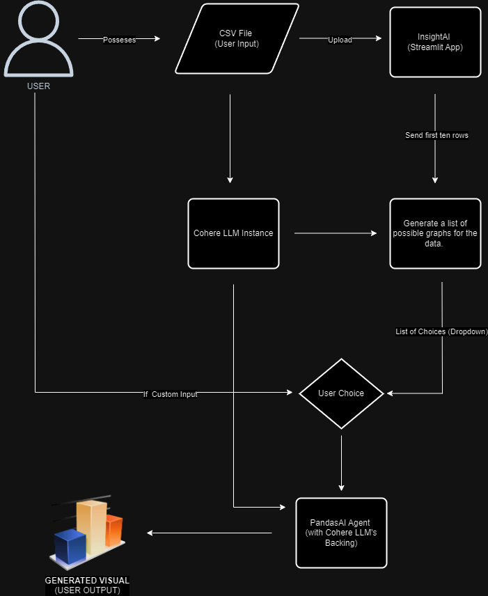

# InsightAI

## Context
In our rapidly advancing technological world, the ability to comprehend and utilize data efficiently has become paramount. As data volume grows, finding methods to make it comprehensible becomes crucial. CSV (Comma Separated Values) files, a common format for datasets, contain structured data that professionals, especially Data Scientists, frequently use. Visualizing these relationships and distributions simplifies data analysis. 

InsightAI aims to automate the visualization of data from CSV files using Generative AI models. The end goal is to create an interactive application that takes CSVs as input and responds with various graphs based on the CSV's data, enhancing the data analysis process.

## Approach and Methodologies
1. **Model Selection**: 
   - **Research**: A thorough search for suitable models that cater to the needs of visual data representation.
   - **Testing and Feasibility**: Iterative testing of identified models to select the most appropriate one.

2. **Model Choices**: 
   - [Pandas Dataframe Agent by Langchain](https://python.langchain.com/v0.2/docs/integrations/toolkits/pandas/)
   - [LIDA by Microsoft](https://github.com/microsoft/lida)
   - [PandasAI by Sinaptik-AI](https://github.com/Sinaptik-AI/pandas-ai)

3. **Final Model**: 
   - **PandasAI**: Chosen for its integration capabilities with the Pandas library, ease of use, and cost-effectiveness.
   - **Cohere LLM**: Selected for backend integration due to its compatibility and efficiency.

4. **Implementation**:
   - Leverage the SmartDataframe functionality of PandasAI to utilize the power of existing LLM models.
   - Use Cohere's 'command-r-plus' model to automate the analysis operations on the dataset.

## High-Level Workflow

## Libraries and Tools Used
- **Streamlit**: For creating the web application interface.
- **Pandas**: For handling CSV files and data manipulation.
- **PandasAI**: For integrating LLM capabilities into data analysis.
- **Cohere**: For backend support with LLM capabilities.
- **Matplotlib**: For generating graphs and visual representations.
- **dotenv**: For managing environment variables.

## App Usage
To use and test the app, follow these steps:
1. **Activate the Virtual Environment**:
   - On Windows: `.\venv\Scripts\activate`
   - On macOS/Linux: `source venv/bin/activate`
   
2. **Update API Keys**:
   - Open the `.env` file in the project directory and update the `COHERE_KEY` with your Cohere API key.
   - **Note**: The application will not work unless the Cohere API key is correctly set in the `.env` file.

3. **Run the Application**:
   - Execute the command: `streamlit run app.py`

## Scopes of Improvement
- **Enhanced Query Handling**: Improve the ability to manage a wider variety of user queries.
- **Output Accuracy**: Address biases in the outputs and improve the accuracy of generated graphs.
- **Documentation**: Enhance the documentation for easier error tracing and debugging.
- **Custom Solution Architecture**: Explore building a custom solution architecture using LLMs and code interpreters for more control and flexibility.
- **Integration with NLP Libraries**: Include NLP capabilities to create word clouds from textual data.
- **Integration with LIDA**: Incorporate LIDA for more precise data-inclined recommendations for visual representation.

## Thank You
Thank you for exploring InsightAI! This project represents a small-scale implementation of modern Generative AI tools to facilitate data visualization and analysis. I hope this tool proves useful and sparks further innovation in data science and AI applications.
